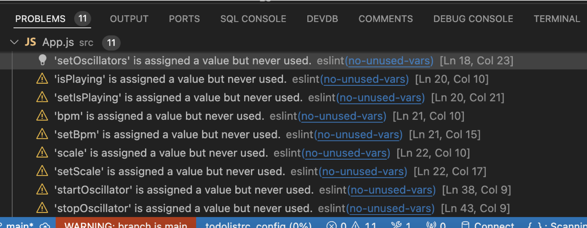

# Drum Machine / Sequencer v2


Creating a drum machine/sequencer with Web Audio API that allows users to generate and sequence different waveforms, apply filters, and export audio or MIDI files is an exciting project. Below is a high-level overview and code snippets to help you get started.

### Overview

1. **Setup Project**: Create a basic React project.
2. **Web Audio API**: Use Web Audio API to generate sounds and apply filters.
3. **Sequencer**: Implement a sequencer to create patterns.
4. **Export Options**: Provide options to export audio and MIDI files.
5. **UI Components**: Create UI components to interact with the sequencer.

### Setup Project

1. **Create React App**:

```bash
npx create-react-app drum-machine
cd drum-machine
npm install @tonejs/midi
```

### Web Audio API and Sequencer

2. **Create AudioContext and Oscillators**:

In `src/App.js`, create an audio context and oscillators for different waveforms:

```javascript
import React, { useState, useEffect, useRef } from 'react';
import { Midi } from '@tonejs/midi';
import './App.css';

const App = () => {
    const [audioContext, setAudioContext] = useState(null);
    const [oscillators, setOscillators] = useState([]);
    const [currentPattern, setCurrentPattern] = useState([]);
    const [isPlaying, setIsPlaying] = useState(false);
    const [bpm, setBpm] = useState(120);
    const [scale, setScale] = useState('C');

    useEffect(() => {
        const context = new (window.AudioContext || window.webkitAudioContext)();
        setAudioContext(context);
    }, []);

    const createOscillator = (type) => {
        const osc = audioContext.createOscillator();
        osc.type = type;
        osc.connect(audioContext.destination);
        return osc;
    };

    const startOscillator = (oscillator) => {
        oscillator.start();
    };

    const stopOscillator = (oscillator) => {
        oscillator.stop();
    };

    const generatePattern = () => {
        // Generate a random pattern based on the selected scale
        // For simplicity, we will use a fixed pattern here
        const pattern = [
            { time: 0, type: 'sine' },
            { time: 0.5, type: 'square' },
            { time: 1, type: 'sawtooth' },
            { time: 1.5, type: 'triangle' },
        ];
        setCurrentPattern(pattern);
    };

    const playPattern = () => {
        if (!audioContext || !currentPattern.length) return;

        currentPattern.forEach(note => {
            const osc = createOscillator(note.type);
            osc.start(audioContext.currentTime + note.time);
            osc.stop(audioContext.currentTime + note.time + 0.25);
        });
    };

    const recordAudio = () => {
        // Implement recording functionality
    };

    const exportMidi = () => {
        const midi = new Midi();
        const track = midi.addTrack();
        currentPattern.forEach(note => {
            track.addNote({
                midi: 60, // Middle C
                time: note.time,
                duration: 0.25,
            });
        });
        const midiData = midi.toArray();
        const blob = new Blob([midiData], { type: 'audio/midi' });
        const url = URL.createObjectURL(blob);
        const a = document.createElement('a');
        a.href = url;
        a.download = 'sequence.mid';
        a.click();
    };

    return (
        <div className="App">
            <header className="App-header">
                <h1>Drum Machine / Sequencer</h1>
                <div>
                    <button onClick={generatePattern}>Generate Pattern</button>
                    <button onClick={playPattern}>Play Pattern</button>
                    <button onClick={recordAudio}>Record Audio</button>
                    <button onClick={exportMidi}>Export MIDI</button>
                </div>
            </header>
        </div>
    );
};

export default App;
```

### UI Components

3. **Add CSS for styling**:

In `src/App.css`, add styles for the buttons and layout:

```css
.App {
    text-align: center;
}

.App-header {
    display: flex;
    flex-direction: column;
    align-items: center;
    justify-content: center;
    min-height: 100vh;
    background-color: #282c34;
    color: white;
}

button {
    margin: 10px;
    padding: 10px 20px;
    font-size: 16px;
    cursor: pointer;
}
```

### Export Audio

4. **Implement recording functionality**:

To record audio, you can use the `MediaRecorder` API. Update the `recordAudio` function:

```javascript
const recordAudio = () => {
    const mediaStreamDestination = audioContext.createMediaStreamDestination();
    const mediaRecorder = new MediaRecorder(mediaStreamDestination.stream);

    currentPattern.forEach(note => {
        const osc = createOscillator(note.type);
        osc.connect(mediaStreamDestination);
        osc.start(audioContext.currentTime + note.time);
        osc.stop(audioContext.currentTime + note.time + 0.25);
    });

    mediaRecorder.start();

    setTimeout(() => {
        mediaRecorder.stop();
    }, 2000); // Record for 2 seconds

    mediaRecorder.ondataavailable = (e) => {
        const blob = new Blob([e.data], { type: 'audio/wav' });
        const url = URL.createObjectURL(blob);
        const a = document.createElement('a');
        a.href = url;
        a.download = 'sequence.wav';
        a.click();
    };
};
```

### Final Steps

5. **Run the Application**:

6. **Start the React frontend**:

```bash
npm start
```

Now you have a basic drum machine/sequencer that can generate random patterns, play them, and export them as MIDI or audio files. You can further enhance this by adding more features like different scales, more complex patterns, and additional audio effects.

————-

* allow for samples to be added and dragged in 


---
## Issues:

